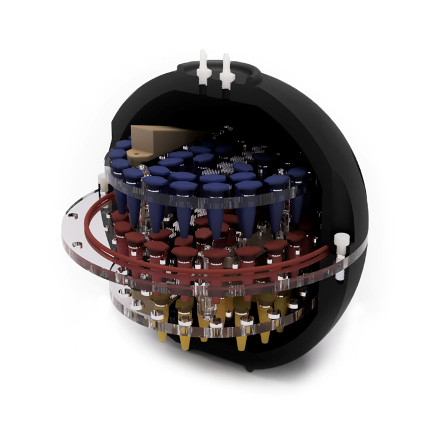

  

# "Death Star" Imaging Phantom 

## Bill of Materials

| Part                                                                 | Quantity |
| -------------------------------------------------------------------- | -------- |
| Acetal rod 250mm (180mm diameter)                                    | 1        |
| Acrylic sheet 5mm                                                    | 1        |
| Glass-Filled Nylon Socket Head Screws M5×0.8, 20mm                   | 12       |
| Impact-Resistant Polycarbonate Pan Head Phillips Screws M3×0.5, 10mm | 24       |
| Tight-Seal Moisture-Resistant Acetal Barbed Tube Fitting M6×1        | 2        |
| Tight-Seal Moisture-Resistant Acetal Barbed Tube Fitting M6×1        | 2        |

## Acknowledgements

The authors acknowledge the facilities and scientific and technical assistance of the National Imaging Facility, a National Collaborative Research Infrastructure Strategy (NCRIS) capability, at the Melbourne Brain Centre Imaging Unit, University of Melbourne.

## Licensing

The materials are shared under the Creative Commons license which enables reusers to distribute, remix, adapt, and build upon the material in any medium or format for noncommercial purposes only, and only so long as attribution is given to the creator. If you remix, adapt, or build upon the material, you must license the modified material under identical terms.
