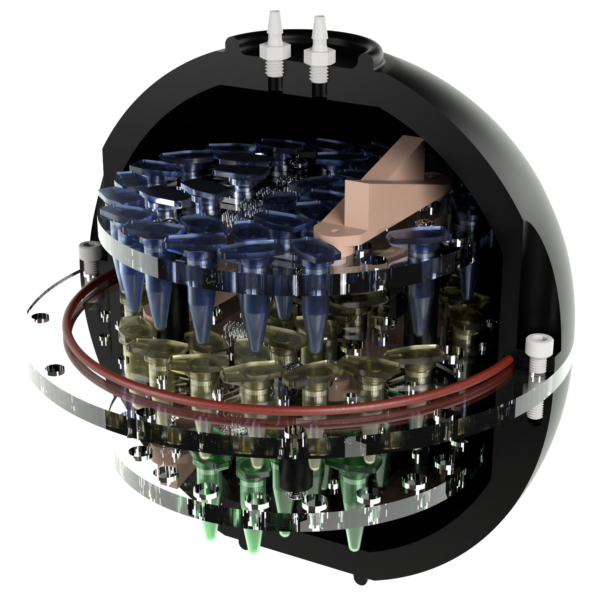

  

# "Death Star" Imaging Phantom 

Welcome to our GitHub repository showcasing the development of a universal MRI imaging phantom, meticulously crafted to cater to a spectrum of research and clinical needs. This phantom presents a multilayered architecture nestled within a spherical shell, promising versatility and adaptability for MRI experimentation and calibration endeavours.

## Features

- Multilayered structure enclosed in a spherical shell
- Outer diameter of 170mm, optimised for compatibility with smaller head coils
- Three layers with multiple mounting holes for various modules and a coarse resolution grid on each
- Top and bottom layers affixed to the middle disc, snugly ensconced between the hemispheres, and reinforced with two silicone o-rings to prevent leakage
- Two tube fittings facilitate easy assembly and disassembly, with one designated for air release during refilling
- Utilising 0.5mL Eppendorf tubes to store any liquids of interest such as T1, T2, or proton density arrays
- The spherical shell is machined on a CNC lathe, while the discs are laser-cut from a 6mm acrylic sheet
- To achieve the desired precision, the resolution grids on the discs are added using a CNC mill, ensuring accuracy

## Additional modules

- Each disc features mounting holes for additional modules, facilitating further customisation and experimentation.
- Extra modules can be 3D printed using a consumer SLA printer
- Two modules are provided: a fine-resolution grid and a slice profile double-wedge
- A template for custom module design is provided

## Bill of Materials

| Part                                                                 | Quantity    |
| -------------------------------------------------------------------- | ----------- |
| Acetal rod 250mm (180mm diameter)                                    | 1           |
| Acetal rod 100mm (10mm diameter)                                     | 1           |
| Acrylic sheet 6mm                                                    | 1           |
| Glass-Filled Nylon Socket Head Screws M5×0.8, 20mm                   | 12          |
| Impact-Resistant Polycarbonate Pan Head Phillips Screws M3×0.5, 10mm | 24          |
| Tight-Seal Moisture-Resistant Acetal Barbed Tube Fitting M6×1        | 2           |
| Tight-Seal Moisture-Resistant Acetal Barbed Tube Fitting M6×1        | 2           |
| Eppendorf tube 0.5ml                                                 | As required |

## Assembly video

https://github.com/igoresso/Phantom-DeathStar/assets/33253240/f2b40d54-d948-43c9-96b6-33f2290663dc

## Acknowledgements

The authors acknowledge the facilities and scientific and technical assistance of the National Imaging Facility, a National Collaborative Research Infrastructure Strategy (NCRIS) capability, at the Melbourne Brain Centre Imaging Unit, University of Melbourne.

## Licensing

The materials are shared under the Creative Commons license which enables reusers to distribute, remix, adapt, and build upon the material in any medium or format for noncommercial purposes only, and only so long as attribution is given to the creator. If you remix, adapt, or build upon the material, you must license the modified material under identical terms.
